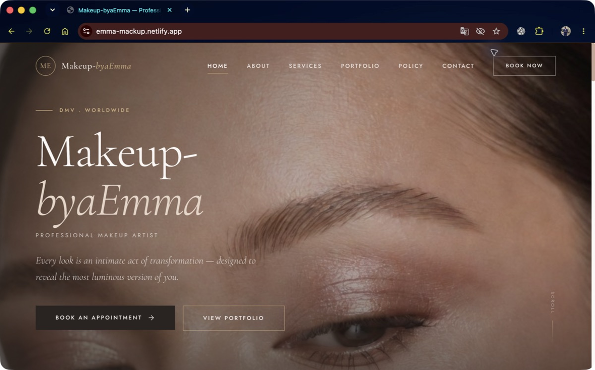
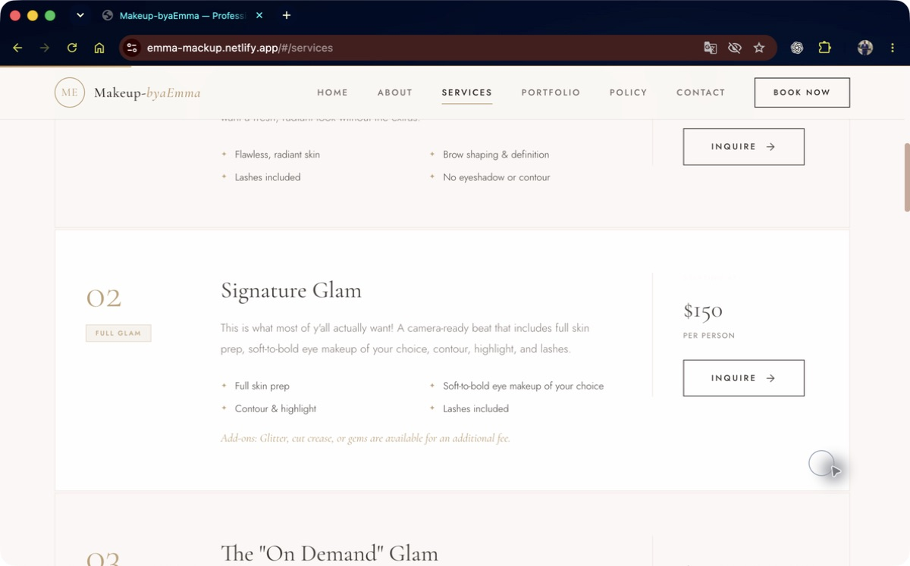
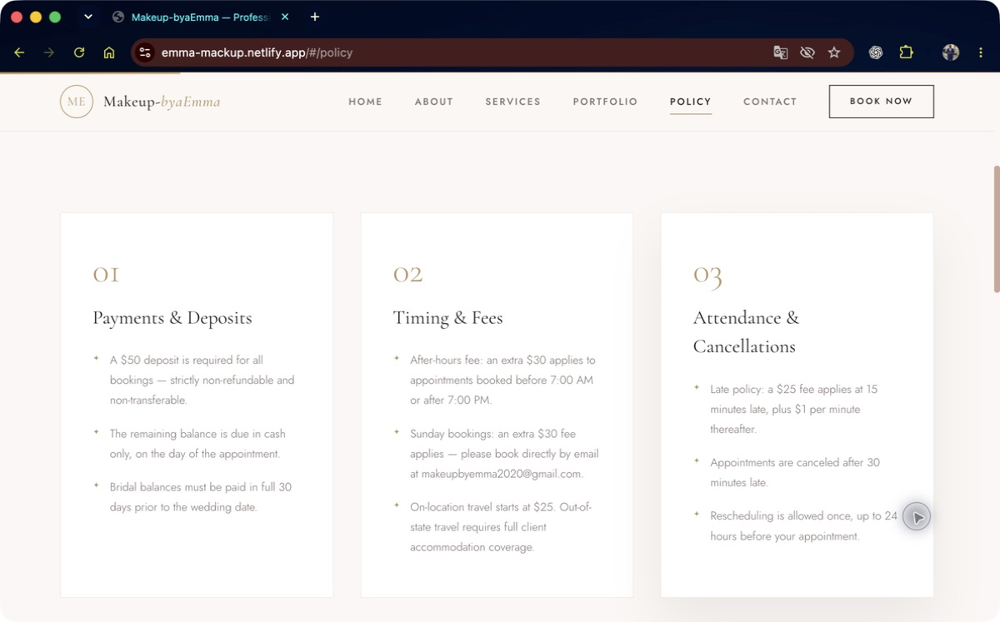
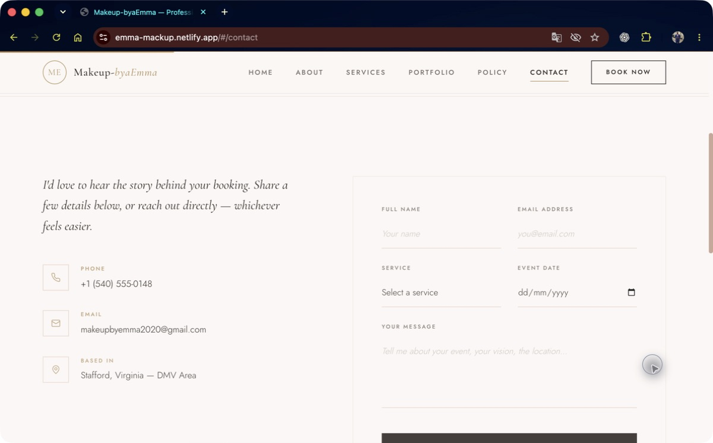
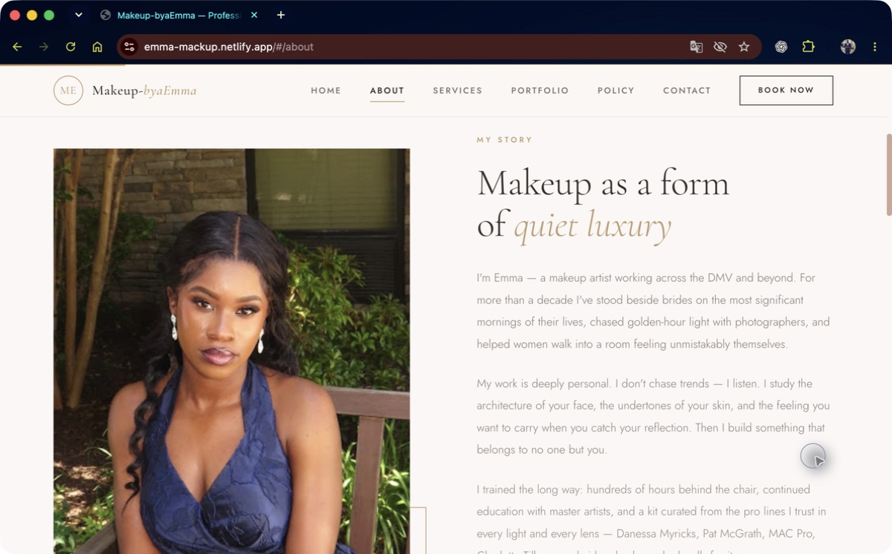
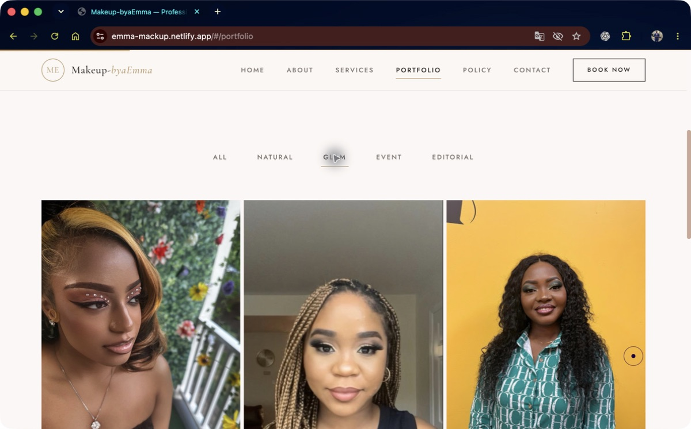
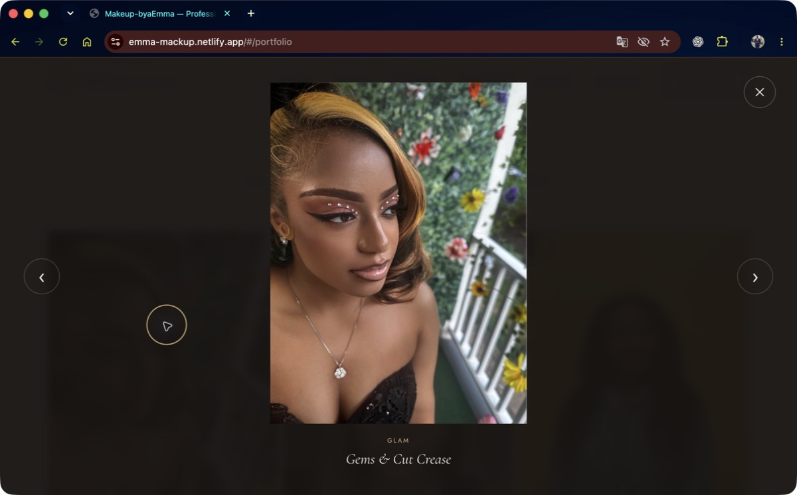
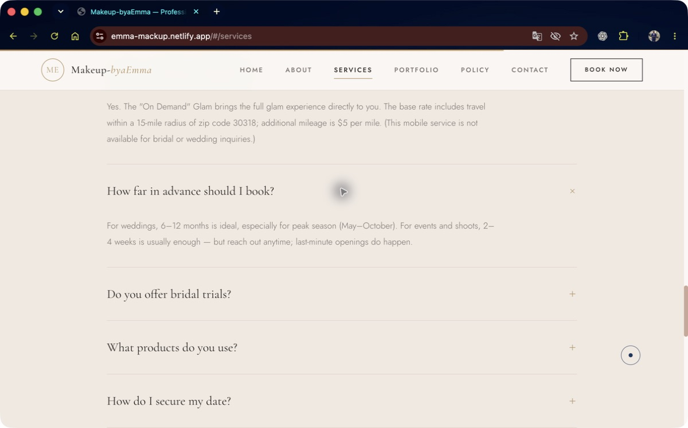
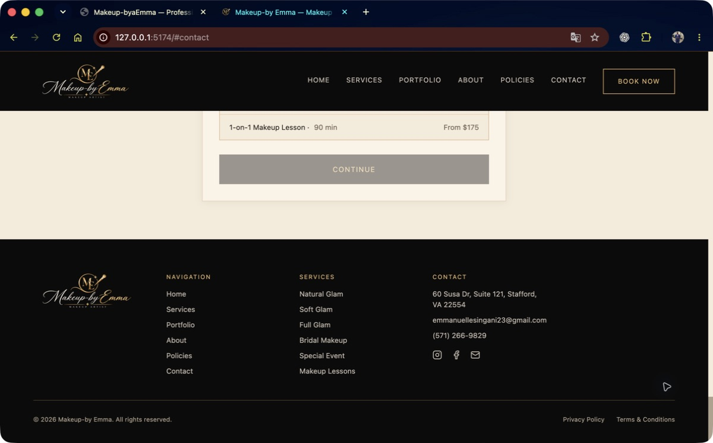
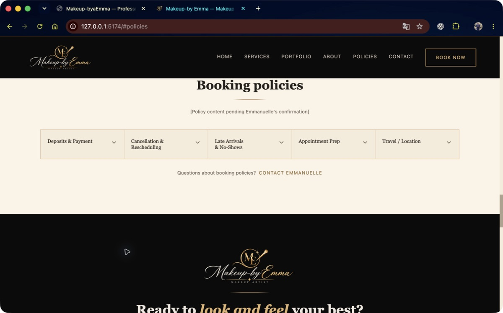

# Makeup-by Emma — audit de source et intégration sélective

Date : 10 septembre 2026. Source secondaire : [emma-mackup.netlify.app](https://emma-mackup.netlify.app/). Produit principal : dépôt `emma-cosmetics`. Aucun déploiement ni changement en base de données.

> Mise à jour : le client a ensuite confirmé les informations du site secondaire et demandé de conserver les deux numéros de téléphone. L'intégration appliquée est enregistrée dans [CONFIRMED_INTEGRATION.json](CONFIRMED_INTEGRATION.json). Les champs absents du site secondaire restent à déterminer ; ils ne peuvent pas être confirmés sans valeur.

**Décision : conserver le produit actuel et son identité officielle. Aucun tarif, contact, témoignage ou règlement externe n'est suffisamment établi pour remplacer la configuration actuelle.** Deux améliorations de navigation sont intégrées ; un test existant est isolé du réseau. Les propositions métier sont consignées dans [CLIENT_CONFIRMATION_REQUIRED.json](CLIENT_CONFIRMATION_REQUIRED.json), sans import dans l'application.

## Méthode et limites

Inspection du HTML public téléchargé ce jour, du JavaScript et du CSS intégrés, des six routes déclarées, des liens, des onze images référencées et des fichiers publics de découverte. Parcours réel via Chrome natif après indisponibilité des surfaces navigateur intégrée et Chrome automatisée. La traduction automatique du navigateur a été désactivée pour lire les textes anglais originaux ; les captures retenues sont en anglais.

Les faits sont distingués des déclarations du site : « présent dans le code / visible sur la page » ne veut pas dire « confirmé par Emmanuelle ». Le dépôt et ses commentaires constituent la référence locale ; aucune vérification indépendante des confirmations commerciales historiques n'a été réalisée. Les changements déjà présents dans le dépôt au démarrage ont été préservés.

Pas d'authentification, de formulaire envoyé, d'appel téléphonique, de message, de paiement, de recherche de données privées ou de requête au service FormSubmit. L'inspection des destinations sociales porte sur leurs URL publiques liées ; leur propriété n'est pas établie. Pas d'audit juridique des conditions. La vérification visuelle est desktop ; le responsive externe est lu dans le CSS, sans certification mobile ou lecteur d'écran. Les tests locaux ne prouvent pas le déploiement effectif des migrations, webhooks ou services tiers.

## 1. LIVE SITE SUMMARY — parcours et santé

| Étape | Route ou action | Résultat / santé | Preuve |
|---|---|---|---|
| 1 | [Accueil](https://emma-mackup.netlify.app/#/) | Accessible. Photo plein écran, CTA, présentation, compteurs, trois prestations mises en avant, cinq photos, témoignages et footer. Identité différente. | 01-home |
| 2 | [Services](https://emma-mackup.netlify.app/#/services) | Accessible. Quatre fiches détaillées avec tarifs et inclusions. Plusieurs données incompatibles ou absentes. | 02-services |
| 3 | [Policy](https://emma-mackup.netlify.app/#/policy) | Accessible. Trois catégories, conditions financières et horaires ; détails d'annulation incomplets. | 03-policy |
| 4 | [Contact / Book Now](https://emma-mackup.netlify.app/#/contact) | Accessible. Demande par formulaire ; aucun créneau, encaissement ou confirmation de rendez-vous observé. Envoi non exécuté. | 04-contact |
| 5 | [About](https://emma-mackup.netlify.app/#/about) | Accessible. Portrait, histoire, processus, chiffres et qualifications. Authenticité non établie. | 05-about |
| 6 | [Portfolio : filtre Glam](https://emma-mackup.netlify.app/#/portfolio) | Fonctionne : trois images restent affichées après filtrage. | 06-portfolio-filter |
| 7 | Portfolio : agrandissement | Fonctionne à la souris ; fermeture Échap observée. La sémantique de dialogue et le déplacement du focus sont insuffisants dans le code. | 07-portfolio-lightbox |
| 8 | Services : FAQ | Ouverture de la réponse sur le délai de réservation observée. Six réponses extraites du bundle ; état développé non annoncé par `aria-expanded` dans ce composant. | 08-faq |

Structure technique : application React avec routage par fragment (`/#/about`, etc.). Le bundle déclare `/`, `/about`, `/services`, `/portfolio`, `/policy`, `/contact` et une route générique `*` qui affiche l'accueil. Aucun écran réservé ou route cachée supplémentaire n'a été trouvé dans cette déclaration. `/about` sans fragment, `/robots.txt` et `/sitemap.xml` renvoient HTTP 404 ; ces tests ne signifient pas que `/#/about` échoue.

HTML d'environ 477 000 caractères, JS et CSS intégrés, Google Fonts Cormorant Garamond/Jost. Titre et description génériques ; pas de canonical, Open Graph ou JSON-LD trouvé dans le document/bundle inspecté. Les images publiques `/images/artist.jpg`, `/images/hero.jpg` et `portfolio-01.jpg` à `portfolio-09.jpg` répondent toutes HTTP 200. [Manifeste, tailles et empreintes](public-assets.json). Aucune identité binaire exacte avec les assets locaux ; cela n'exclut pas une photographie commune redimensionnée ou recompressée. Aucun import de ces images dans les assets de production.

## 2–6. BUSINESS DATA EXTRACTED

### Classification

A = donnée métier déclarée ; B = contenu/rédaction ; C = idée de présentation ; D = fonctionnalité ; E = doublon ; F = conflit ou différence à résoudre ; G = non vérifié. Les codes se cumulent : une donnée A peut être F et G. Tous les candidats métier nouveaux sont **CLIENT CONFIRMATION REQUIRED**, même si le montant ressemble à une valeur locale provisoire.

### SERVICES / PRICES FOUND

Source : [Services et FAQ](https://emma-mackup.netlify.app/#/services). Montants affichés « à partir de », en dollars ; ne pas les convertir automatiquement en prix fixes facturables.

| Prestation externe | Tarif / durée | Périmètre annoncé | Classe |
|---|---|---|---|
| Basic Glam, catégorie Natural Glam | 130 $ / durée absente | Teint, sourcils, faux cils ; sans fard à paupières ni contour | A B F G |
| Signature Glam, catégorie Full Glam | 150 $ / durée absente | Préparation, intensité des yeux au choix, contour, illuminateur, cils ; glitter/cut crease/gems en supplément non chiffré | A B E F G |
| On Demand Glam | 300 $ par visite / durée absente | Une personne ; rayon 15 miles depuis ZIP 30318, puis 5 $/mile ; 150 $ par personne supplémentaire ; mariage exclu | A B F G |
| Essential Bridal Package | 600 $ par mariée / 90 min | Préparation personnalisée, maquillage mariage, cils mink, kit retouches, fixation ; session avant mariage décrite comme incluse | A B F G |

Ambiguïté mariage : la durée de 90 min n'explique pas la durée ni la planification de l'essai et du jour J. L'email indiqué pour les groupes et prestations mariage à la journée est `takidamakeup@gmail.com`. Ne pas assimiler automatiquement ce forfait au SKU `bridal-makeup` actuel.

Le catalogue local contient Natural Glam 85 $/45 min, Soft Glam 125 $/60 min, Full Glam 150 $/75 min, Bridal Makeup 225 $/120 min, Special Event Glam 135 $/60 min, Bridal Trial 165 $/60 min et 1-on-1 Makeup Lesson 175 $/90 min. Les prix sont explicitement provisoires ; le seed indique aussi que les durées sont des données de test. L'absence de certains services dans l'autre site ne justifie aucune suppression.

### POLICIES FOUND

Source : [Policy](https://emma-mackup.netlify.app/#/policy), avec répétitions sur Services/FAQ. Toutes les règles suivantes : A/G ; F lorsque différentes du fonctionnement provisoire local.

- Acompte fixe de 50 $ pour chaque réservation, non remboursable et non transférable.
- Solde ordinaire en espèces le jour du rendez-vous ; solde mariage entièrement réglé 30 jours avant.
- Supplément de 30 $ avant 07:00 ou après 19:00 ; cela ne définit pas des horaires d'ouverture.
- Dimanche : supplément de 30 $, demande par email.
- Déplacement à partir de 25 $ ; hébergement hors État pris en charge par la cliente. Articulation non expliquée avec le forfait mobile de 300 $, son rayon et le kilométrage supplémentaire.
- Retard de 15 min : 25 $, puis 1 $ par minute ; rendez-vous annulé après 30 min.
- Un report possible avec au moins 24 h de préavis. L'articulation avec l'acompte non transférable reste à préciser.
- Invitation à contrôler adresse, date, heure et prestation dans l'email de confirmation.

**Non trouvés** : horaires hebdomadaires complets ; délai général d'annulation ; règle spécifique de no-show et éventuels frais additionnels ; traitement d'une annulation par l'artiste ; exceptions/remboursements ; instructions concrètes de préparation de la cliente. La préparation de peau incluse dans une prestation n'est pas une instruction préalable à la cliente.

Localement : les cinq corps de conditions sont `null`, l'acompte frontend `null`, et le défaut serveur est 30 % avec `isConfirmed: false`. Le seed est explicitement non productif : lundi–vendredi 09:00–18:00, samedi 10:00–16:00, dimanche fermé, buffer 15 min. Ne rien remplacer à partir de ces seuls textes externes.

### CONTACT DATA FOUND

Source : [Contact](https://emma-mackup.netlify.app/#/contact), footer et Services.

| Donnée | Site secondaire | Projet actuel | Classe / décision |
|---|---|---|---|
| Téléphone | +1 (540) 555-0148 | +1 (571) 266-9829, commentaire de confirmation locale | A F G ; conserver actuel. Numéro externe d'apparence illustrative, propriété non vérifiée. |
| Email général et demandes | makeupbyemma2020@gmail.com | emmanuellesingani23@gmail.com | A F G ; conserver actuel |
| Email mariage groupes/journée | takidamakeup@gmail.com | Non présent | A F G ; ne pas rediriger de demandes |
| Instagram | instagram.com/make_up_byemma | instagram.com/emma_sing84 et /emma_sing2 | A F G ; confirmer compte officiel |
| WhatsApp | wa.me/15405550148 | Non présent | A F G ; dépend du téléphone conflictuel |
| Facebook | Non trouvé | Profil id=100008196917547 | E ; conserver lien local |
| Adresse | Stafford, Virginia ; adresse exacte renvoyée à l'email de confirmation | 60 Susa Dr, Suite 121, Stafford, VA 22554 | A E F G ; préserver adresse locale |
| Zone | DMV et monde entier ; ZIP mobile 30318 | Fredericksburg & DMV, ZIP 22554 | A E F G ; résoudre le périmètre |
| Réponse | Sous 24 h | Pas de promesse équivalente confirmée | A B G ; confirmer capacité réelle |

### ABOUT / BIO DATA FOUND

Source : [About](https://emma-mackup.netlify.app/#/about), accueil et témoignages. Rédaction orientée personnalisation, écoute, rendu naturel et travail photo/mariage. Bonne matière pour préparer un entretien avec Emmanuelle, pas une biographie validée.

Affirmations A/B/G : activité depuis 2013, 12+ années, 600+ visages, 180+ mariages, licence et assurance, formation continue de niveau expert, pratiques sanitaires à usage unique, airbrush et expérience de toutes carnations. Marques citées : Danessa Myricks, Pat McGrath, MAC Pro et Charlotte Tilbury. Aucun justificatif trouvé dans les pages inspectées. Les nombres sont statiques dans les données ; ils ne constituent pas une preuve.

Processus B/C/G : consultation, essai, jour du rendez-vous, finitions/retouches. Confirmer les étapes incluses par prestation.

Trois témoignages B/G : Ashley M., mariée de Fredericksburg ; Marcus D., directeur créatif de Washington D.C. ; Nia R., cliente d'Alexandria. Résumés : personnalisation du maquillage mariage ; compréhension d'une direction artistique ; compliments lors d'un gala et tenue huit heures. Aucun lien vers une source originale ou preuve de consentement trouvé. Les photos associées viennent de la galerie et ne prouvent pas l'identité des auteurs. Ne pas remplir le témoignage local actuellement `null`.

FAQ B/C/G : déplacement, anticipation (mariage 6–12 mois, événements/shootings 2–4 semaines, saison de pointe mai–octobre), essais, produits, acompte, report/retard. Les thèmes sont utiles ; les réponses restent soumises aux mêmes confirmations.

## 7–14. CURRENT PROJECT COMPARISON

Les colonnes correspondent à la décision : garder l'existant, importer directement, fusionner une idée, ignorer l'implémentation ou demander confirmation. « Différé » signifie proposition, pas travail appliqué.

| ITEM | OTHER WEBSITE | CURRENT PROJECT | KEEP CURRENT | IMPORT | MERGE | IGNORE | NEEDS CLIENT CONFIRMATION |
|---|---|---|---|---|---|---|---|
| Identité (B/F) | Makeup-byaEmma, monogramme ME | Logo officiel Makeup-by Emma, noir/ivoire/champagne/nude | Oui | Non | Non | Branding externe | Non pour conserver |
| Navigation footer (C/D) | Vrais liens vers pages | Rubriques rendues en spans | Styles et rubriques | Non | Liens vers ancres existantes, appliqué | Non | Non |
| Accès aux conditions (C/D/F) | Page réelle | Promesse d'une page inexistante et lien sur lui-même | Accordéon | Non | Aide vers Contact, appliqué | Promesse trompeuse | Non |
| Services et tarifs (A/B/F/G) | Quatre offres détaillées | Sept services provisoires et durées | Oui | Non | Après validation | Mapping automatique | Oui |
| Inclusions/exclusions (B/C/G) | Listes détaillées | Descriptions courtes | Oui | Non | Différé après validation | Copier sans preuve | Oui |
| Acompte (A/F/G) | 50 $ | 30 % de test serveur, frontend non confirmé | Architecture | Non | Après validation | Calcul côté client | Oui |
| Solde / mariage (A/G) | Cash, J−30 | Dépôt Stripe, solde affiché | Oui | Non | Projet futur après validation | Règle copiée sans workflow | Oui |
| Horaires / dimanche (A/F/G) | Frais et email | Seed provisoire, dimanche fermé | Oui | Non | Après validation | Ouvrir dimanche automatiquement | Oui |
| Déplacement (A/F/G) | 25 $, 300 $, ZIP 30318 | Stafford 22554, policy vide | Oui | Non | Après clarification | Import tarif automatique | Oui |
| Coordonnées (A/F/G) | Téléphone, emails, Instagram différents | Valeurs centralisées locales | Oui | Non | Seulement si validées | Remplacement silencieux | Oui |
| Biographie (B/G) | Détaillée, qualifications/chiffres | Texte provisoire explicitement marqué | Oui | Non | Interview puis rédaction | Chiffres non sourcés | Oui |
| Témoignages (B/G) | Trois déclarations | Placeholder honnête | Oui | Non | Uniquement preuve + consentement | Avis non vérifiés | Oui |
| Photographies (B/G) | Onze assets publics | Photos approuvées optimisées | Oui | Non | Différé si droits confirmés | Import global | Oui pour nouvelles photos |
| Galerie (C/D) | Neuf images, filtres, lightbox | Six looks, défilement mobile | Oui | Non | Lightbox accessible possible, différée | Copier le code | Non avec photos locales |
| FAQ (B/C/D) | Six accordéons | Accordéon policies Radix | Composant accessible | Non | Différé après réponses validées | Réponses inventées | Oui pour contenu |
| Réservation (D/E) | Demande FormSubmit | Six étapes, disponibilité, validations serveur | Oui | Non | Pas nécessaire | Remplacement par demande email | Non |
| Paiement (D) | Aucun paiement observé | Stripe / montants serveur / webhook | Oui | Non | Non | Copie architecture secondaire | Non |
| Notifications / calendrier (D) | Texte promettant confirmation | Emails, ICS, Google scaffolding | Oui | Non | Non | Promesses non exécutées | Non |
| SEO (D) | Métadonnées génériques | Métadonnées + JSON-LD centralisé, URL configurable | Oui | Non | Non | Copie métadonnées génériques | Domaine à confirmer séparément |
| Animation (C) | Curseur, lettres animées, compteurs | Design officiel / focus visible | Oui | Non | Non | Animation décorative additionnelle | Non |
| Tests (D) | Non visibles publiquement | 213 tests ; deux dépendaient de .env.local | Suite | Non | Isolation du test, appliquée | Appels live dans tests fallback | Non |

**USEFUL UX IDEAS** : listes d'inclusions/exclusions, FAQ près des tarifs, navigation effective en footer, possibilité d'examiner une photographie. Préserver la palette, les images officielles et la hiérarchie du projet principal. Les colonnes externes très espacées et le texte pâle sont des risques de lisibilité visibles, pas des mesures certifiées de contraste.

**USEFUL FUNCTIONAL IDEAS** : filtres et agrandissement de galerie. Différés car ils ajoutent un parcours interactif nécessitant validation du focus, du clavier et du mobile ; le site actuel a seulement six images, donc le bénéfice des filtres reste modeste. Aucun remplacement de booking par contact-form.

**DUPLICATES** : navigation générale, présentation, coordonnées cliquables, CTA, services, portfolio, catégories de politiques, présence sociale. Conserver les versions du produit principal sauf les deux liens corrigés.

**WHAT CURRENT SITE ALREADY DOES BETTER** : identité officielle, catalogue centralisé avec inconnues explicites, images locales, champs de réservation validés, états accessibles de sélection, accordéon Radix, focus global, lien de saut, montants côté serveur, contrainte d'exclusion PostgreSQL, idempotence, holds/expiration, signature de webhook Stripe, confirmation uniquement après traitement serveur, notifications et ICS. Google Calendar reste un échafaudage configurable : son fonctionnement en production n'est pas établi par cet audit. `src/lib/seo.js` omet volontairement les avis, horaires et tarifs non confirmés du JSON-LD.

## 15. CLIENT CONFIRMATION NEEDED / CONFLICTS FOUND

Priorité : coordonnées et identité officielle ; prix/durée/périmètre de chacune des sept offres ; correspondance Basic/Signature avec Natural/Soft/Full ; composition et calendrier du mariage/essai ; acompte et solde ; dimanche, déplacements et horaires ; annulation/report/retard/no-show ; préparation ; biographie, qualifications, statistiques et avis originaux.

Le ZIP 30318, l'email `takidamakeup@gmail.com` et le téléphone divergent de la référence locale. Ce sont des signaux de contenu possiblement réutilisé, pas une preuve de copie ni de fraude. Même le prix commun de 150 $ ne valide pas la donnée. L'existence d'un titre « Terms & conditions » ne garantit pas une politique complète.

Le [JSON de confirmation](CLIENT_CONFIRMATION_REQUIRED.json) comporte source, valeur observée, référence locale, classes, raison, cibles futures et `approvedValue: null`. Il est situé dans la documentation, sans import runtime. Rien ne doit être appliqué tant que les valeurs et leur périmètre ne sont pas explicitement approuvés.

## SELECTIVE INTEGRATION PLAN — communiqué avant modifications

| Changement | Source | Cible | Raison | Risque | Logique métier | Confirmation |
|---|---|---|---|---|---|---|
| Liens de footer, appliqué | Footer externe + Header/App locaux | `src/components/Footer.jsx` | Transformer des libellés inertes en accès réels ; mêmes ancres que le header | Faible ; vérifier destinations et focus | Non | Non |
| Aide depuis les conditions, appliquée | Page Policy réelle vs lien local circulaire | `src/components/PoliciesSection.jsx` | Éviter de promettre une page absente ; joindre l'artiste pour clarifier | Faible ; texte et ancre uniquement | Non | Non |
| Isoler les tests fallback, appliqué | Deux timeouts de la suite avant modification | `src/booking/availability.test.js` | Empêcher `.env.local` d'activer Supabase dans des tests explicitement hors connexion | Faible ; double de module uniquement dans tests | Non | Non |
| Propositions métier, documentées | Pages externes + config/seed locaux | `docs/audits/2026-09-10-secondary-site/CLIENT_CONFIRMATION_REQUIRED.json` | Ne perdre aucune piste sans la publier | Faible tant que fichier hors runtime | Non actuellement | Oui avant intégration |
| Tarifs, durées et contenu, différés | Services/FAQ | `src/config/business.js`, table services via migration revue | Compléter données après validation | Élevé : montants, durée d'occupation, mapping SKU | Oui | Oui |
| Règles, déplacements et acompte, différés | Policy/Services | Config, `booking_policies`, `availability_rules`, `depositConfig.js`, fonctions serveur concernées | Appliquer des règles cohérentes, pas seulement du texte | Élevé : paiements et cycle de réservation | Oui | Oui |
| Bio, témoignages, images, différés | About/Home/Portfolio | Config, composants actuels, assets approuvés | Compléter les contenus authentifiés | Moyen : fausses affirmations/droits | Non | Oui |
| Galerie accessible, différée | Portfolio | `src/components/SelectedLooks.jsx`, Dialog existant | Examiner les photos locales sans recadrage | Moyen : clavier, focus, mobile, scroll | Non | Non si images locales |
| FAQ, différée | Services | Config et accordéon existant | Répondre aux questions avant réservation | Moyen : engagements dans réponses | Non si éditorial seulement | Oui pour réponses |

## SAFE CHANGES IMPLEMENTED / FILES CHANGED

1. `src/components/Footer.jsx` : six liens de navigation, zone `nav` nommée ; six libellés de services mènent aux prestations. Aucun service n'est présélectionné, aucun nouveau booking n'est créé par ces liens.
2. `src/components/PoliciesSection.jsx` : la phrase annonçant une page détaillée inexistante et son lien circulaire deviennent une invitation à contacter Emmanuelle. Les cinq catégories et placeholders restent présents.
3. `src/booking/availability.test.js` : le client Supabase est explicitement non configuré dans ces tests unitaires ; aucun changement dans `availability.js` ni dans le code de production.
4. Dossier de cet audit : rapport, JSON de confirmation, manifeste des assets, huit captures externes, captures locales de vérification et logs de test/lint/build.

Les modifications préexistantes de `App.jsx`, `BookingFlow.jsx`, `ClientDetailsStep.jsx`, `main.jsx`, `dist/` et les fichiers déjà non suivis n'ont pas été attribuées à cette intervention. `.env.local` n'a pas été affiché ni modifié. Build vers `/private/tmp/emma-secondary-audit-build` pour préserver le `dist/` préexistant.

## FEATURES PRESERVED / SECURITY NOTES

Aucun changement des fonctions Supabase, migrations, seed, schémas, availability, Stripe, holds, idempotence, emails, ICS, Google Calendar, tokens de marque ou photos de production. Aucun appel mutatif externe. Les URL de destinataires externes ne sont pas intégrées.

Le formulaire secondaire envoie nominalement nom, email, prestation, date et message à `https://formsubmit.co/ajax/…`. Le bundle définit `_captcha: false` et traite un HTTP réussi comme un envoi réussi ; l'envoi et la livraison effective n'ont pas été testés. Aucun moteur de réservation, Supabase ou Stripe n'a été trouvé dans ce bundle : cela décrit le frontend inspecté, pas l'ensemble d'une infrastructure inconnue. Ne pas reprendre ce transport ni sa promesse de confidentialité dans le produit principal.

Risques externes confirmés par source : labels de formulaire sans liaison `htmlFor`/`id`, FAQ sans `aria-expanded`, lightbox sans rôle modal ni gestion explicite du focus, focus observé restant sur la vignette après ouverture. Échap ferme la lightbox ; cela ne suffit pas à garantir son accessibilité complète. Les textes animés lettre par lettre apparaissent fragmentés dans l'arbre d'accessibilité et ont été déformés par la traduction automatique initiale. Aucun score de conformité globale n'est revendiqué.

Point de durcissement local préexistant : `availability.js` revient à des disponibilités simulées si la lecture Supabase échoue. Le serveur conserve le contrôle final, mais cette présentation peut montrer des créneaux inexacts ; traiter séparément une stratégie d'erreur explicite avant production, sans changer silencieusement ce comportement pendant l'audit de contenu.

## TEST RESULTS / BUILD RESULT / LINT RESULT

- Avant modifications : 211/213 tests passaient ; deux timeouts dans `availability.test.js` parce que des tests supposant Supabase absent dépendaient de l'environnement local. Lint déjà à 0 erreur / 6 avertissements.
- Après isolation du test : **213/213 tests, 16 fichiers réussis** avec `npm test -- --reporter=dot`. [Log](tests.log). Le message de fallback non configuré est attendu. Ce sont des tests locaux, pas un test concurrent de PostgreSQL déployé ni une transaction Stripe réelle.
- **Build réussi** via `npm run build -- --outDir /private/tmp/emma-secondary-audit-build`. [Log](build.log). Un avertissement de dépréciation Node apparaît ; aucune erreur de compilation.
- **Lint : 0 erreur, 6 avertissements préexistants** `react-refresh/only-export-components` dans badge/button/form/navigation-menu/sidebar/toggle. [Log](lint.log).
- Vérification de navigation locale : voir captures 09 et 10, ajoutées après contrôle du footer et du retour Contact. Aperçu avec variables Supabase vides uniquement pour ce processus ; aucun réglage persistant modifié.

## NEXT RECOMMENDED ACTION

Faire compléter le JSON de confirmation par Emmanuelle, en priorité les coordonnées, le catalogue, les règles de paiement et le périmètre géographique. Puis préparer une migration revue et une configuration cohérente frontend/serveur, suivies des tests d'intégration Supabase/Stripe déjà documentés. Ne pas exécuter le seed de développement sur la production.

## Captures de preuve

### 01 — Accueil

### 02 — Fiche Signature Glam

### 03 — Conditions

### 04 — Contact

### 05 — Biographie

### 06 — Filtre Glam

### 07 — Agrandissement

### 08 — FAQ ouverte

### 09 — Footer local corrigé

### 10 — Conditions locales et lien Contact

Le clic Policies dans le footer atteint `#policies`, puis Contact Emmanuelle revient à `#contact` et aux coordonnées locales. Les couleurs, le logo et les placeholders visibles sont conservés.

## Intégration confirmée

Le 10 septembre 2026, le client a accepté les informations du site secondaire et demandé de conserver les deux numéros. L'intégration est consignée dans [`CONFIRMED_INTEGRATION.json`](CONFIRMED_INTEGRATION.json). La vérification finale comprend 214 tests réussis, un build de production réussi, aucune erreur ESLint et aucune erreur dans la console du navigateur. La migration Supabase a été créée localement mais n'a pas été appliquée à une base distante, et le site n'a pas été déployé.
